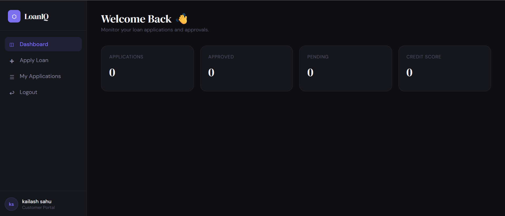
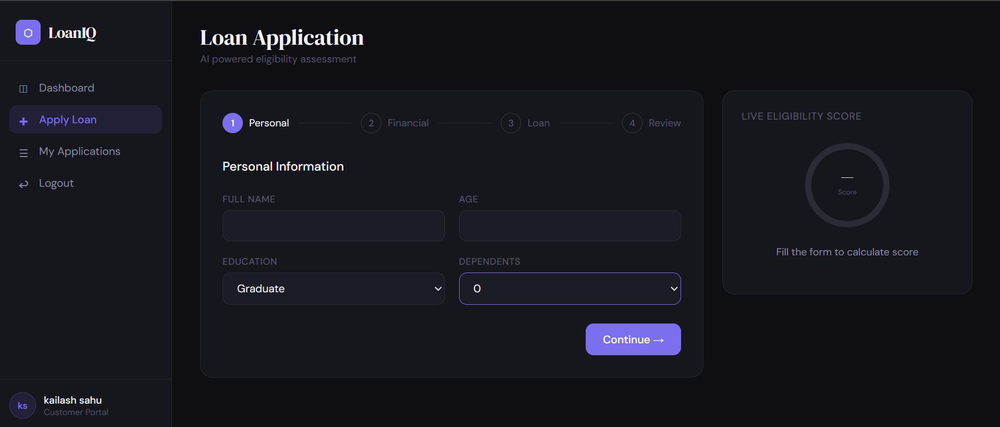
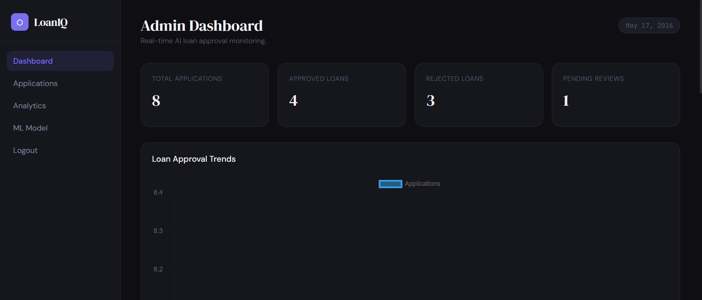
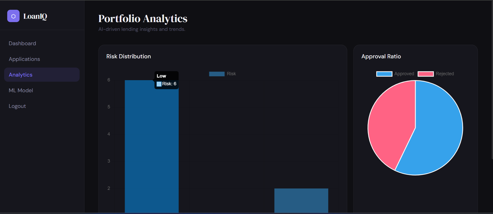
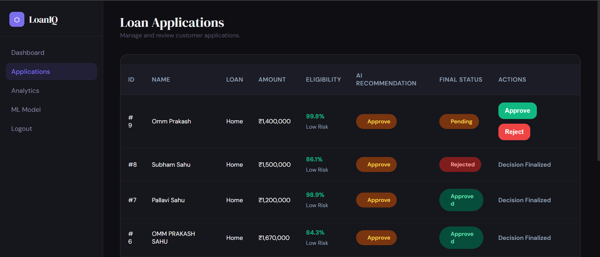

# 🏦 LoanIQ — Intelligent Loan Approval System

> A full-stack, ML-powered loan approval platform featuring a Node.js backend, a Python FastAPI machine learning service, and a beautiful dark-themed Vanilla JS frontend.

---

## 🏗️ Architecture Overview

LoanIQ is built using a modern microservice-inspired architecture:

1. **Frontend (`/frontend`)**: A responsive, dark-themed SPA built with HTML5, CSS3, Vanilla JavaScript, and Chart.js.
2. **Backend API (`/backend`)**: A Node.js & Express server handling JWT authentication, MySQL database interactions, and business logic.
3. **ML Service (`/ml-service`)**: A Python FastAPI service that hosts a Scikit-Learn Random Forest model to evaluate loan applications in real-time.
4. **Database**: MySQL database storing users, applications, and system logs.

---

## 🛠️ Tech Stack

*   **Frontend**: HTML5, CSS3, Vanilla JS, Chart.js 4.4
*   **Backend**: Node.js, Express, `mysql2`, `jsonwebtoken`, `bcryptjs`, `cors`
*   **ML Service**: Python 3.10+, FastAPI, Uvicorn, Scikit-Learn, Pandas, NumPy, Joblib
*   **Database**: MySQL Server
*   **Design**: Custom Dark Theme, Glassmorphism, Google Fonts (DM Serif Display, DM Sans)

---

## 🌟 Key Features

### 👤 Customer Portal
*   **Secure Authentication**: JWT-based login and registration system.
*   **Loan Application Wizard**: Multi-step form collecting personal, financial, and loan requirement details.
*   **Real-time Feedback**: Live EMI calculation based on loan terms.
*   **Application Tracking**: View the status of past loan applications.

### 🛡️ Admin Dashboard
*   **Real-time Analytics**: KPI cards and Chart.js graphs showing total applications, approval rates, and risk distributions.
*   **Application Management**: Review pending applications, see the AI's recommendation (Risk Score, Interest Rate, Probability), and manually Approve/Reject.
*   **Model Insights**: View ML Model performance metrics (Accuracy, Precision, Recall, AUC-ROC).

### 🧠 Machine Learning Engine
*   **Ensemble Model**: Trained using Random Forest with engineered features (DTI ratio, Credit Tier).
*   **Explainable AI**: Returns specific "Reason Codes" explaining why an application was approved or rejected.
*   **Dynamic Pricing**: Automatically calculates personalized interest rates based on credit score.

---

## 📸 Screenshots

### 1. Customer Dashboard Wizard


### 2. Loan Application



### 3. Admin Dashboard


### 4. Admin Analytics


### 5. Submitted Applications


---
## 🚀 Local Running Steps

Follow these steps to get the entire stack running locally on your machine.

### Prerequisites
*   [Node.js](https://nodejs.org/) (v18+)
*   [Python](https://www.python.org/) (v3.10+)
*   [MySQL Server](https://dev.mysql.com/downloads/mysql/)

---

### Step 1: Database Setup

1. Open your MySQL command line or a GUI tool like MySQL Workbench.
2. Run the following commands to create the database and a dedicated user (or use your `root` user):

```sql
CREATE DATABASE loan_system;
-- If using a specific user as configured in the backend:
CREATE USER 'root'@'localhost' IDENTIFIED BY 'your_database_password';
GRANT ALL PRIVILEGES ON loan_system.* TO 'root'@'localhost';
FLUSH PRIVILEGES;
```

---

### Step 2: Start the Python ML Service

The ML service evaluates loan applications via an API.

1. Open a new terminal and navigate to the ML service folder:
   ```bash
   cd ml-service
   ```
2. Create and activate a virtual environment (Recommended):
   ```bash
   # Windows
   python -m venv venv
   .\venv\Scripts\activate
   
   # macOS/Linux
   python3 -m venv venv
   source venv/bin/activate
   ```
3. Install the required Python libraries:
   ```bash
   pip install -r ../requirements.txt
   ```
4. Train the model (generates `loan_model.pkl`):
   ```bash
   python train_model.py
   ```
5. Start the FastAPI server on **Port 8000**:
   ```bash
   uvicorn app:app --port 8000 --reload
   ```

---

### Step 3: Start the Node.js Backend

The Node backend handles auth and acts as a bridge between the frontend, the database, and the ML API.

1. Open a **second** terminal and navigate to the backend folder:
   ```bash
   cd backend
   ```
2. Install Node dependencies:
   ```bash
   npm install
   ```
3. Create a `.env` file in the `backend` folder (if it doesn't exist) and configure it:
   ```env
   PORT=5000
   DB_HOST=localhost
   DB_USER=root
   DB_PASSWORD=your_database_password
   DB_NAME=loan_system
   JWT_SECRET=your_super_secret_jwt_key
   ML_API_URL=http://127.0.0.1:8000
   ```
4. Start the Express server on **Port 5000**:
   ```bash
   npm run dev
   # OR: node server.js
   ```

---

### Step 4: Run the Frontend

1. Open a **third** terminal and navigate to the frontend folder:
   ```bash
   cd frontend
   ```
2. You can serve the frontend using any lightweight HTTP server. For example, using Python or Node:
   ```bash
   # Using Python
   python -m http.server 5500
   
   # OR using Node (npx)
   npx serve .
   ```
3. Open your browser and navigate to:
   **http://localhost:5500/login.html**

*Tip: You can also use the **Live Server** extension in VS Code to run the frontend instantly.*

---

## 👨‍💻 Login Credentials

To test the application, you can use the following default roles:

**Customer**
* Register a new account via the `/login.html` page by toggling to "Customer" mode.

**Admin Dashboard**
* You must have an account with the role `admin` in your MySQL `users` table. 
* *Example Local Admin*: `admin@gmail.com` / `admin123`

---

*Built to demonstrate end-to-end ML system design, from data engineering and API development to production-grade UI integration.*
